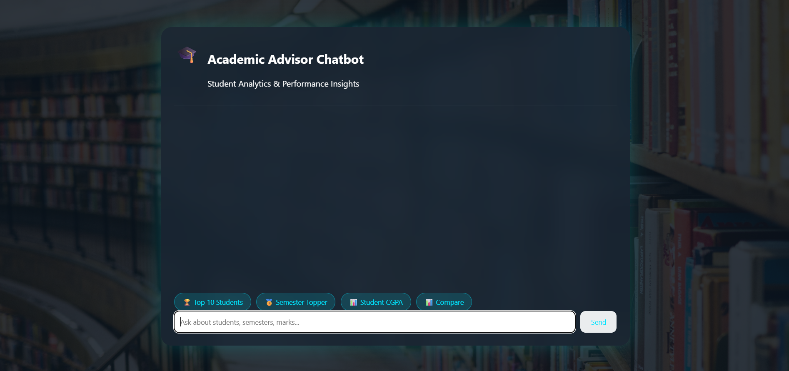
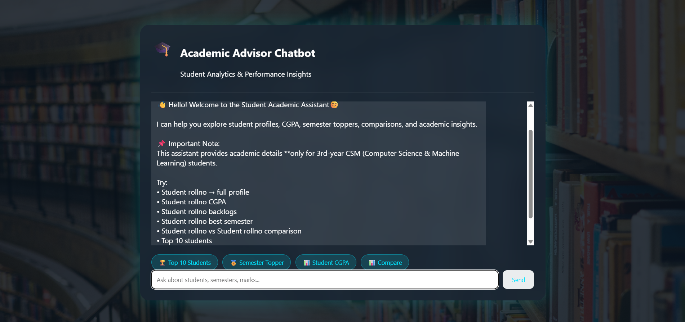
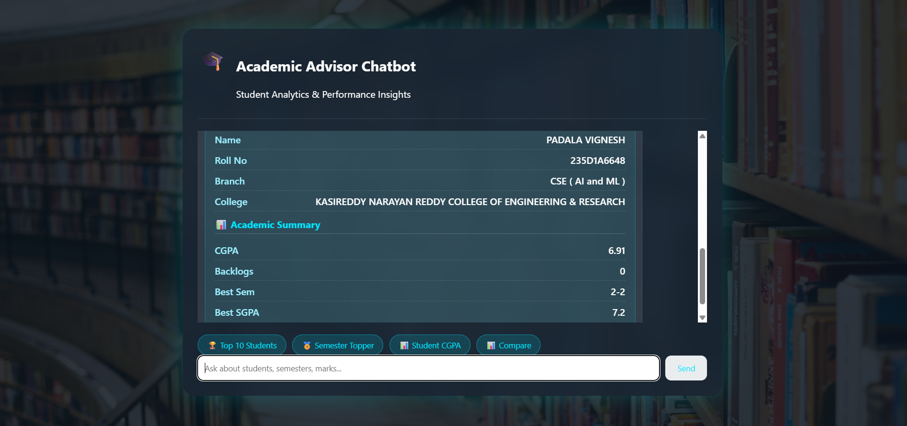
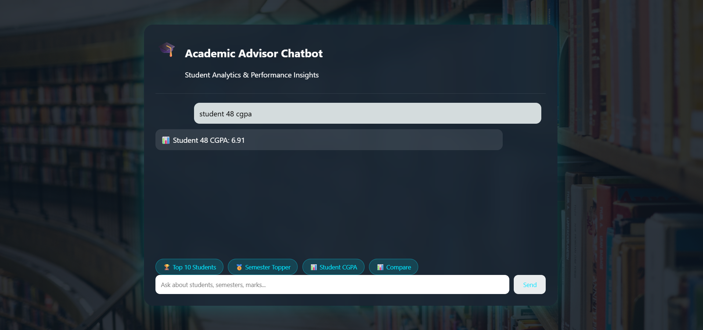
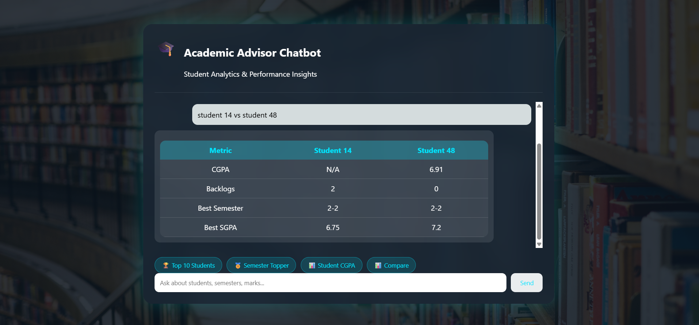

# 🎓 Student Academic Assistant Chatbot

A Django-based web application to manage and analyze student academic data.

## 🚀 Features
- Search students by roll number
- Automatic CGPA calculation
- Compare two students
- Identify semester toppers
- View academic performance

## 🛠 Tech Stack
- Backend: Python, Django
- Frontend: HTML, CSS, JavaScript
- Database: SQL / SQLite

## 📸 Screenshots

## ▶ How to Run Locally
git clone https://github.com/vigneshpadala/academic-advisor-chatbot.git  
cd academic-advisor-chatbot  
pip install -r requirements.txt  
python manage.py runserver  

Open browser:
http://127.0.0.1:8000

## 🌐 Live Demo
https://vigneshpadala48.pythonanywhere.com/

## 👤 Author

Vignesh Padala

B.Tech CSE (AI & ML) Student
