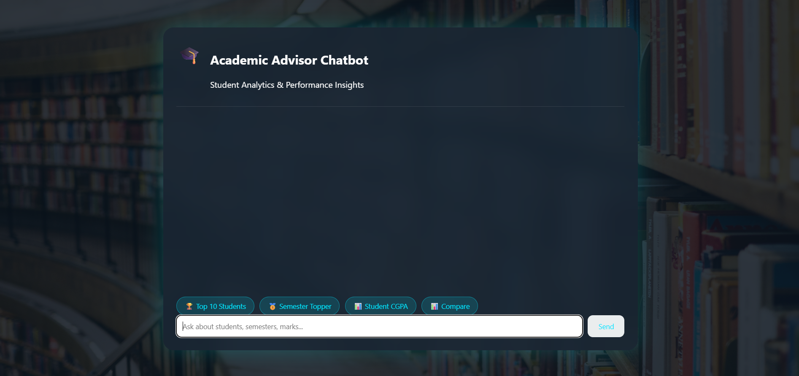
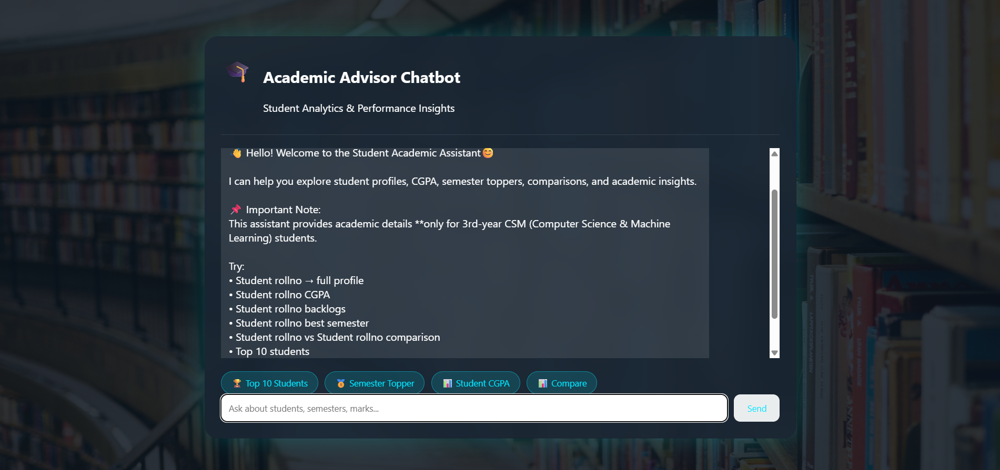
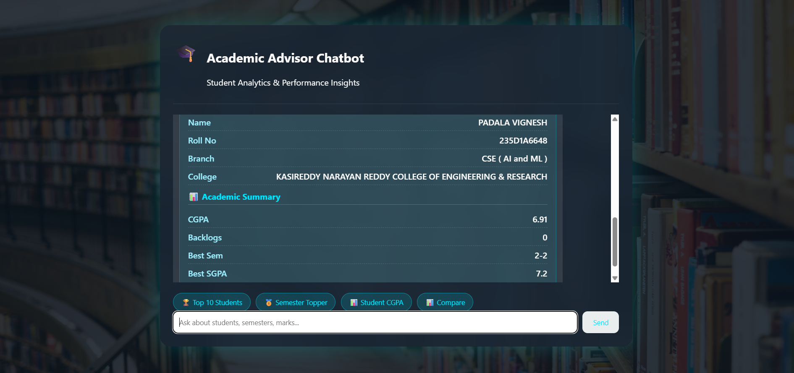
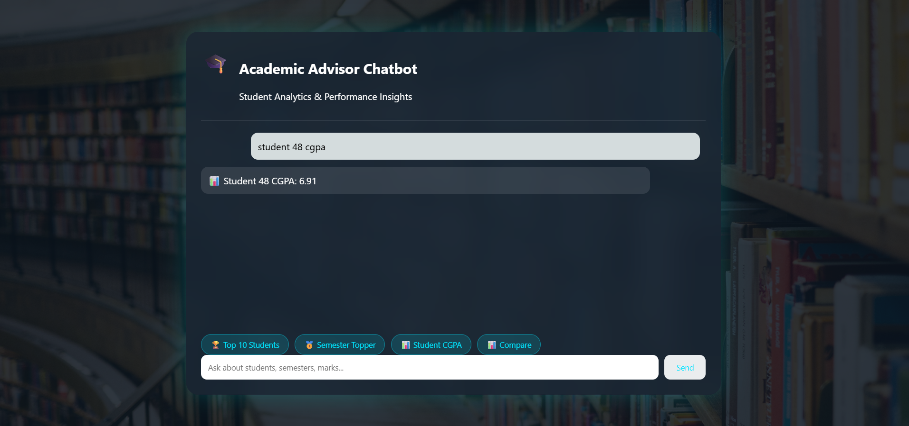
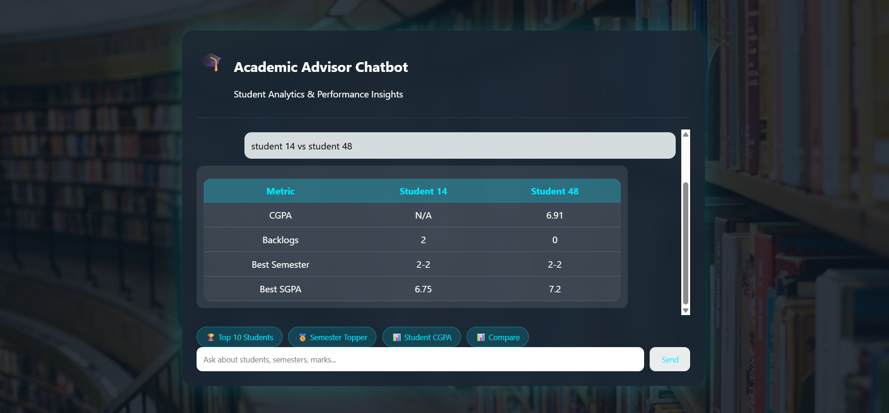

### Backend Setup (Django)

1.**Clone the repository**
git clone https://github.com/vigneshpadala/academic-advisor-chatbot.git

2️.**Navigate to Project Folder**
cd academic-advisor-chatbot

3️. **Create Virtual Environment**
python -m venv venv

4️.**Activate Virtual Environment**
Windows
venv\Scripts\activate

Mac / Linux
source venv/bin/activate

5.**Install Dependencies**
pip install -r requirements.txt

6️.**Apply Migrations**
python manage.py migrate

✅**App runs at:**
http://127.0.0.1:8000/

---

### 📖 Usage
Open browser and visit:

Copy code

http://127.0.0.1:8000/

Start chatting with the Academic Advisor Bot

---

**You can ask about:**

Student profile

Academic results

Semester details

General academic help

The chatbot responds dynamically based on implemented logic

---

**🌐 Deployment**

Backend Deployment (Render / Railway)

Push the code to GitHub

Connect the repository to Render or Railway

Build Command

pip install -r requirements.txt

Start Command

gunicorn chatbot_project.wsgi

Add required environment variables if needed

---

**Deploy 🚀**

🔮 Future Improvements

🤖 AI-powered chatbot (OpenAI / LLM integration)

🔐 Student authentication (login & signup)

📊 Database-backed real student academic results

📱 Fully mobile-responsive UI

🧠 NLP-based query understanding

🎓 Admin dashboard for academic management

---

### 🤖 About the Project

Academic Advisor Chatbot is an AI-assisted student analytics system built using Django.

It uses rule-based NLP, intent detection, and automated academic analytics to understand user queries and provide accurate academic insights.

This project does not rely on a generative AI model; instead, it focuses on deterministic logic and structured data extraction to ensure reliability and correctness.

---

**APIs Used:**

-Custom Django Backend API (HTTP/POST)

-Django ORM

-PDF Processing (pdfplumber)

---

## 🚀 Features
- Search students by roll number
- Automatic CGPA calculation
- Compare two students
- Identify semester toppers
- View academic performance

---

## 🛠 Tech Stack
- Backend: Python, Django
- Frontend: HTML, CSS, JavaScript
- Database: SQL / SQLite

---

## 📸 Screenshots

---

## ▶ How to Run Locally
git clone https://github.com/vigneshpadala/academic-advisor-chatbot.git  
cd academic-advisor-chatbot  
pip install -r requirements.txt  
python manage.py runserver  

**Open browser:**
http://127.0.0.1:8000

---

## 🌐 Live Demo
https://academic-advisor-chatbot-7.onrender.com/

---

## 👤 Author

Vignesh Padala

B.Tech CSE (AI & ML) Student

